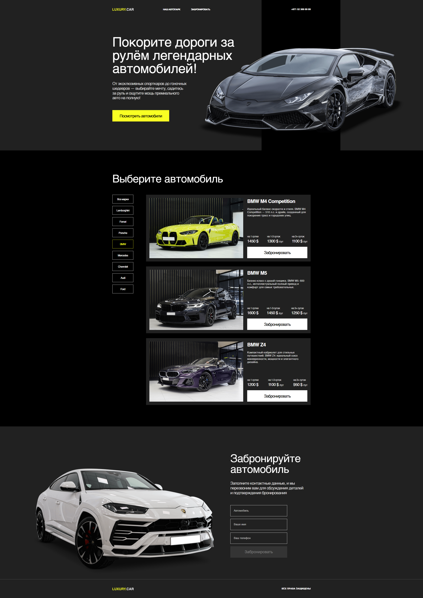

Ссылка на **live-версию**: https://temmh.github.io/PetProject-Cars/

Исходный код для разработки находится в ветке **main**.

Собранные файлы для GitHub Pages находятся в ветке **gh-pages**.


Веб-приложение для каталогизации автомобилей, построенное на Angular. Позволяет просматривать, фильтровать автомобили по марке машины.

# Установка 


1. Клонирование репозитория

```git clone https://github.com/TemMH/PetProject-Cars.git```

2. Установка зависимостей и запуск

```npm install && npm start```
